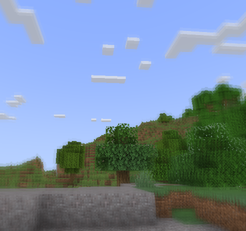
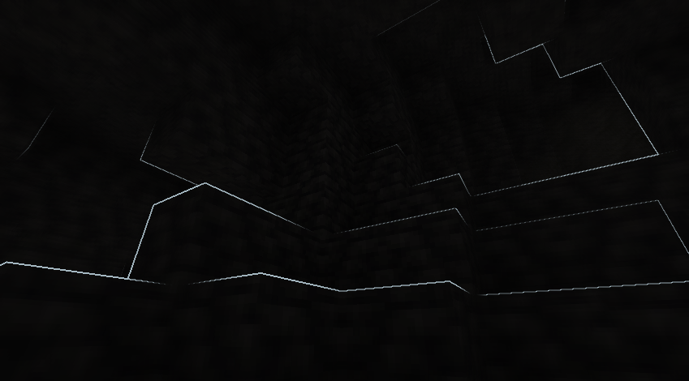
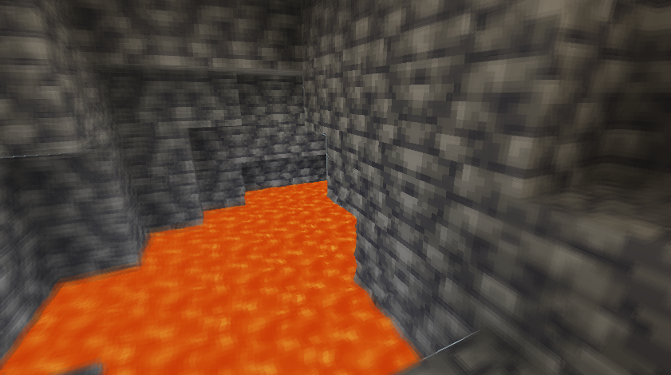

# Enhanced Vision

## Features:
 1. It shows outlines of mobs and walls around the centre screen, with outline brightness increasing as darkness increases.
 2. It adds a shimmering effect above lava and other heat sources to mimic real-life shimmering over fire sources
 3. It blurs objects which are on the side of the screen, with the strength of the blur effect increasing with increasing distance of the object from the centre of the screen.
